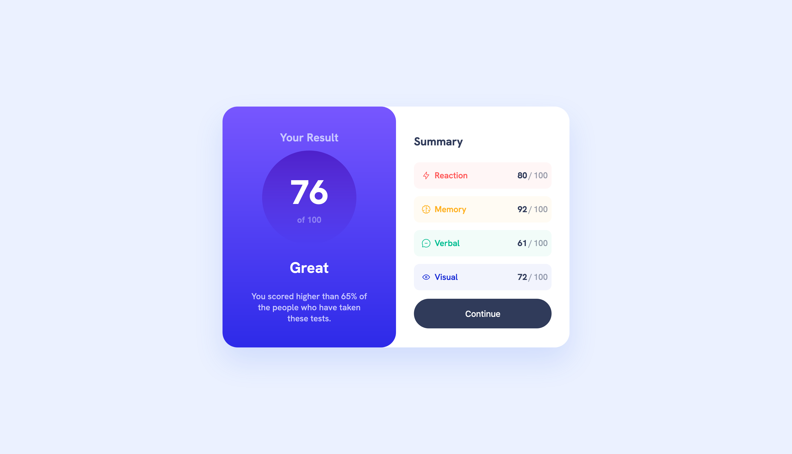

### The challenge

Users should be able to:

- View the optimal layout for the interface depending on their device's screen size
- See hover and focus states for all interactive elements on the page

### Screenshot

### Links

- Live Site URL: [click here](https://antonistarzynski.github.io/Result-summary-component/)

### Built with

- Semantic HTML5 markup
- Sass
- Flexbox
- Mobile-first workflow

## Author

- Website - [Antek Starzynski](https://www.antekstarzynski.com)
- Frontend Mentor - [@antonistarzynski](https://www.frontendmentor.io/profile/antonistarzynski)
- Instagram - [@antek.s](https://www.instagram.com/antek.s/)

